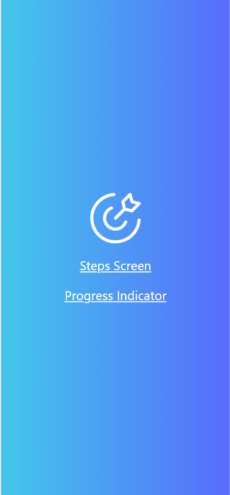
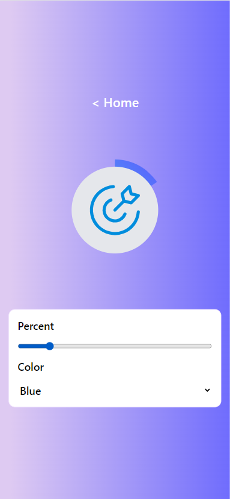
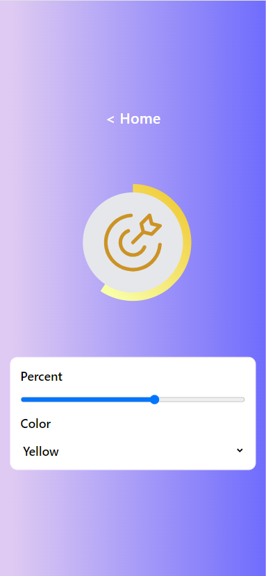
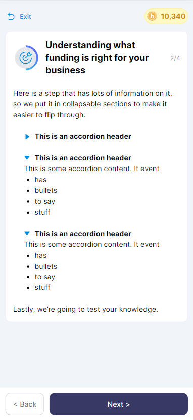

# Progress Indicator Project

## Development

From your terminal:

```sh
npm install
```

This installs all dependencies for the project.

```sh
npm run dev
```

This starts your app in development mode, rebuilding assets on file changes.

## Application Screenshots

### Splash 

### Blue

### Green

### Yellow

### Steps Screen
